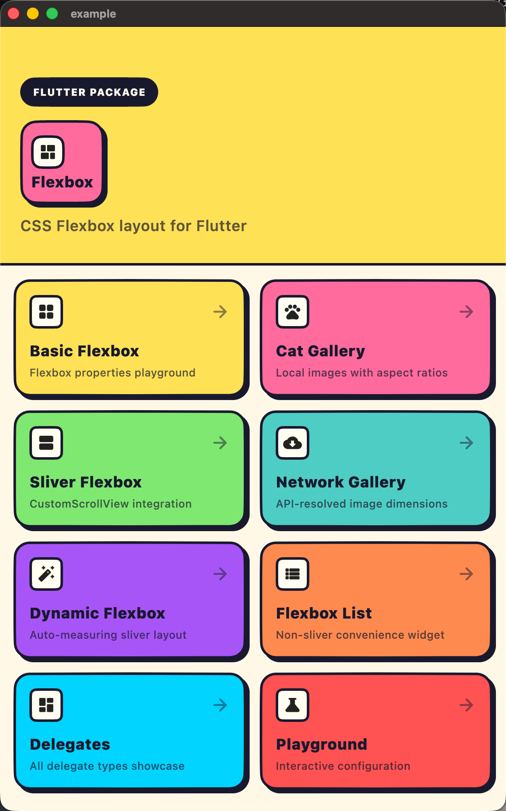
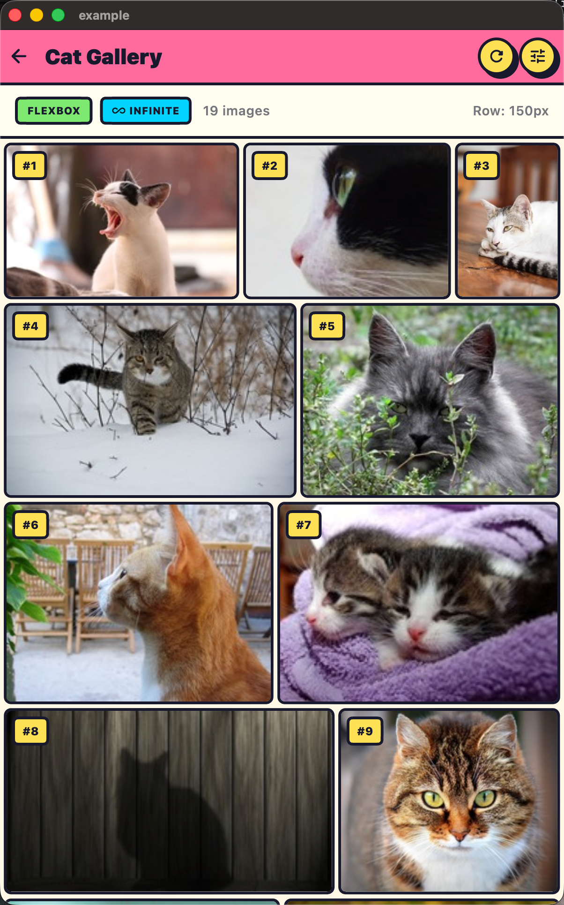
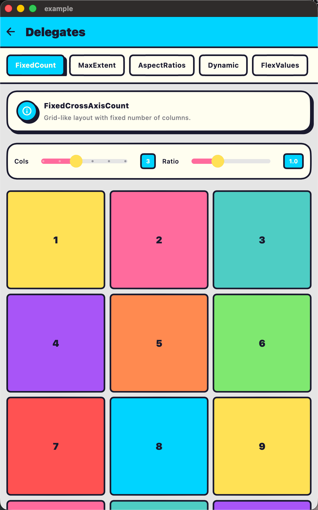

# Flexbox

<div align="center">
  
</div>

A Flutter library for CSS Flexbox layout. This package provides widgets for creating layouts using the CSS Flexbox layout model, bringing the power and flexibility of flexbox to Flutter.

[](https://pub.dev/packages/flexbox)
[](https://pub.dev/packages/flexbox)
[](https://pub.dev/packages/flexbox/score)
[](https://pub.dev/packages/flexbox/score)
[](https://pub.dev/documentation/flexbox/latest/)
[](https://fluttercandies.github.io/flexbox/)

## Live Demo

Try out the interactive demo: **[https://fluttercandies.github.io/flexbox/](https://fluttercandies.github.io/flexbox/)**

## Screenshots

| | |
|:---:|:---:|
|  |  |
|  |  |

## Features

- **Flexbox Widget**: Similar to Flutter's `Wrap` but with full flexbox layout support including `flex-grow`, `flex-shrink`, `justify-content`, `align-items`, and more.
- **FlexItem Widget**: Wrap children with flex item properties like `order`, `flexGrow`, `flexShrink`, `alignSelf`, and `flexBasisPercent`.
- **SliverFlexbox**: A sliver version for use in `CustomScrollView` with item recycling and viewport-based rendering.
- **FlexboxList**: A convenience widget similar to `GridView` but with flexbox layout capabilities.
- **DynamicFlexbox**: Dynamic flexbox layout that automatically adjusts item sizes based on aspect ratios.
- **DimensionResolver**: Utilities for asynchronously resolving dimensions (e.g., image sizes).

## Installation

Add this to your package's `pubspec.yaml` file:

```yaml
dependencies:
  flexbox: any
```

## Usage

### Basic Flexbox

```dart
import 'package:flexbox/flexbox.dart';

Flexbox(
  flexDirection: FlexDirection.row,
  flexWrap: FlexWrap.wrap,
  justifyContent: JustifyContent.spaceBetween,
  alignItems: AlignItems.center,
  mainAxisSpacing: 8,
  crossAxisSpacing: 8,
  children: [
    FlexItem(
      flexGrow: 1,
      child: Container(width: 100, height: 100, color: Colors.red),
    ),
    FlexItem(
      flexGrow: 2,
      child: Container(width: 100, height: 100, color: Colors.blue),
    ),
    FlexItem(
      flexGrow: 1,
      alignSelf: AlignSelf.flexEnd,
      child: Container(width: 100, height: 100, color: Colors.green),
    ),
  ],
)
```

### FlexboxList

```dart
FlexboxList.count(
  crossAxisCount: 3,
  mainAxisSpacing: 8,
  crossAxisSpacing: 8,
  padding: const EdgeInsets.all(8),
  children: List.generate(
    100,
    (index) => Card(
      child: Center(child: Text('Item $index')),
    ),
  ),
)
```

### FlexboxList with Max Extent

```dart
FlexboxList.extent(
  maxCrossAxisExtent: 200, // Maximum width per item
  mainAxisSpacing: 8,
  crossAxisSpacing: 8,
  children: List.generate(
    100,
    (index) => Card(child: Center(child: Text('Item $index'))),
  ),
)
```

### SliverFlexbox in CustomScrollView

```dart
CustomScrollView(
  slivers: [
    SliverAppBar(title: Text('Flexbox')),
    SliverFlexbox(
      delegate: SliverChildBuilderDelegate(
        (context, index) => Card(child: Text('Item $index')),
        childCount: 100,
      ),
      flexboxDelegate: SliverFlexboxDelegateWithFixedCrossAxisCount(
        crossAxisCount: 3,
        mainAxisSpacing: 8,
        crossAxisSpacing: 8,
      ),
    ),
  ],
)
```

### DynamicFlexboxList for Image Galleries

**Just works!** Images are automatically measured and arranged to fill each row.

```dart
DynamicFlexboxList(
  targetRowHeight: 200,
  mainAxisSpacing: 4,
  crossAxisSpacing: 4,
  itemBuilder: (context, index) {
    return Image.network(images[index].url, fit: BoxFit.cover);
  },
  itemCount: images.length,
)
```

### SliverDynamicFlexbox with Aspect Ratios

```dart
CustomScrollView(
  slivers: [
    SliverDynamicFlexbox(
      flexboxDelegate: SliverDynamicFlexboxDelegate(
        targetRowHeight: 200,
        mainAxisSpacing: 4,
        crossAxisSpacing: 4,
      ),
      childDelegate: SliverChildBuilderDelegate(
        (context, index) => Image.network(images[index].url),
        childCount: images.length,
      ),
    ),
  ],
)
```

### Using DimensionResolver for Pre-loading Image Sizes

```dart
class _GalleryState extends State<_Gallery> with DimensionResolverMixin {
  final List<String> imageUrls = [...];

  @override
  void initState() {
    super.initState();
    // Pre-load all image dimensions
    for (int i = 0; i < imageUrls.length; i++) {
      resolveImageDimension(NetworkImage(imageUrls[i]), key: i);
    }
  }

  @override
  Widget build(BuildContext context) {
    return SliverFlexboxDelegateWithDynamicAspectRatios(
      childCount: imageUrls.length,
      aspectRatioProvider: getAspectRatio, // From mixin
      defaultAspectRatio: 1.0,
      // ...
    );
  }
}
```

### Using DynamicFlexItem for Problematic Widgets

**When to use**: If your child uses `Stack` with `StackFit.expand` or other widgets that don't handle unbounded constraints well during intrinsic size measurement.

```dart
SliverDynamicFlexbox(
  flexboxDelegate: SliverDynamicFlexboxDelegate(...),
  childDelegate: SliverChildBuilderDelegate(
    (context, index) => DynamicFlexItem(
      child: Stack(
        fit: StackFit.expand,
        children: [
          Image.network(images[index], fit: BoxFit.cover),
          Positioned(bottom: 8, left: 8, child: Text('Label')),
        ],
      ),
    ),
    childCount: images.length,
  ),
)
```

**Note**: For simple `Image` widgets, you don't need `DynamicFlexItem` - use them directly.

## API Reference

### Enums

| Enum | Values | Description |
|------|--------|-------------|
| `FlexDirection` | `row`, `rowReverse`, `column`, `columnReverse` | Direction of the main axis |
| `FlexWrap` | `noWrap`, `wrap`, `wrapReverse` | Whether items wrap to multiple lines |
| `JustifyContent` | `flexStart`, `flexEnd`, `center`, `spaceBetween`, `spaceAround`, `spaceEvenly` | Alignment along the main axis |
| `AlignItems` | `flexStart`, `flexEnd`, `center`, `baseline`, `stretch` | Alignment along the cross axis |
| `AlignSelf` | `auto`, `flexStart`, `flexEnd`, `center`, `baseline`, `stretch` | Override parent's `AlignItems` |
| `AlignContent` | `flexStart`, `flexEnd`, `center`, `spaceBetween`, `spaceAround`, `stretch` | Alignment of flex lines |

### FlexItem Properties

| Property | Type | Default | Description |
|----------|------|---------|-------------|
| `order` | `int` | `1` | Order of the item in the flex container |
| `flexGrow` | `double` | `0.0` | How much the item should grow relative to others |
| `flexShrink` | `double` | `1.0` | How much the item should shrink relative to others |
| `alignSelf` | `AlignSelf` | `auto` | Cross-axis alignment override |
| `flexBasisPercent` | `double` | `-1.0` | Initial size as a percentage (0.0-1.0) of parent |
| `minWidth` | `double?` | `null` | Minimum width constraint |
| `minHeight` | `double?` | `null` | Minimum height constraint |
| `maxWidth` | `double?` | `null` | Maximum width constraint |
| `maxHeight` | `double?` | `null` | Maximum height constraint |
| `wrapBefore` | `bool` | `false` | Force a wrap before this item |

### Available Widgets

| Widget | Description |
|--------|-------------|
| `Flexbox` | Basic flexbox layout widget (non-scrolling) |
| `FlexItem` | Wrapper for children with flex properties |
| `FlexboxList` | Scrollable list with flexbox layout |
| `SliverFlexbox` | Sliver version for CustomScrollView |
| `DynamicFlexboxList` | Auto-sizing flexbox list (measures children) |
| `SliverDynamicFlexbox` | Dynamic sliver for CustomScrollView |
| `DynamicFlexItem` | Wrapper for children with unbounded constraint issues |

### Dimension Resolution Utilities

| Class/Type | Description |
|------------|-------------|
| `DimensionResolver` | Async dimension resolver for images and custom content |
| `DimensionResolverMixin` | Mixin for easy dimension resolution in State classes |
| `BatchDimensionResolver` | Batch dimension resolution with progress tracking |
| `ItemDimension` | Immutable class representing width/height with aspect ratio support |
| `ImageProviderDimensionExtension` | Extension to get dimensions from ImageProvider |

### Available Delegates

| Delegate | Description |
|----------|-------------|
| `SliverFlexboxDelegateWithFixedCrossAxisCount` | Grid-like layout with fixed items per row/column |
| `SliverFlexboxDelegateWithMaxCrossAxisExtent` | Responsive layout with max item size |
| `SliverFlexboxDelegateWithAspectRatios` | Variable aspect ratios (pre-known) |
| `SliverFlexboxDelegateWithDynamicAspectRatios` | Dynamic aspect ratios via callback |
| `SliverFlexboxDelegateWithFlexValues` | Custom flex grow values per item |
| `SliverFlexboxDelegateWithBuilder` | Fully customizable via builder callback |

### SliverDynamicFlexboxDelegate Options

| Property | Type | Default | Description |
|----------|------|---------|-------------|
| `targetRowHeight` | `double` | `200.0` | Target height for each row |
| `mainAxisSpacing` | `double` | `0.0` | Spacing between rows |
| `crossAxisSpacing` | `double` | `0.0` | Spacing between items in a row |
| `minRowFillFactor` | `double` | `0.8` | Min fill ratio for last row (0.0-1.0) |
| `defaultAspectRatio` | `double` | `1.0` | Fallback aspect ratio when not measured |
| `debounceDuration` | `Duration` | `150ms` | Delay before applying size updates |
| `aspectRatioChangeThreshold` | `double` | `0.01` | Min change (1%) to trigger layout update |
| `crossAxisExtentChangeThreshold` | `double` | `1.0` | Min viewport width change to clear cache |
| `aspectRatioGetter` | `function?` | `null` | Optional callback to provide aspect ratios |

## Architecture

### Component Hierarchy

```
Flexbox (RenderObjectWidget)
├── RenderFlexbox (RenderObject)
│   └── FlexboxParentData
│       └── FlexItemData
│
FlexItem (ParentDataWidget)
└── applies FlexItemData to children

FlexboxList (StatelessWidget)
└── CustomScrollView
    └── SliverFlexbox
        └── RenderSliverFlexbox
            └── SliverFlexboxParentData

DynamicFlexboxList (StatelessWidget)
└── CustomScrollView
    └── SliverDynamicFlexbox
        └── RenderSliverDynamicFlexbox
            └── SliverDynamicFlexboxParentData
```

### Layout Algorithm

1. **Measure children** and determine their intrinsic sizes
2. **Group into flex lines** based on flexWrap and available space
3. **Distribute free space** using flexGrow/flexShrink ratios
4. **Apply alignment** (justify-content, align-items, align-content)
5. **Position children** with proper offsets

## Example

See the [example](example/) directory for a complete sample app demonstrating all features:

- Basic Flexbox usage
- FlexboxList with fixed cross axis count
- DynamicFlexbox with aspect ratio based layout
- Network Image Gallery
- Interactive Playground

## Contributing

Contributions are welcome! Please feel free to submit a Pull Request.

## License

This project is licensed under the MIT License - see the [LICENSE](LICENSE) file for details.

Copyright (c) 2026 iota9star

## Credits

This library is inspired by CSS Flexbox layout and Google's [flexbox-layout](https://github.com/google/flexbox-layout) for Android.
